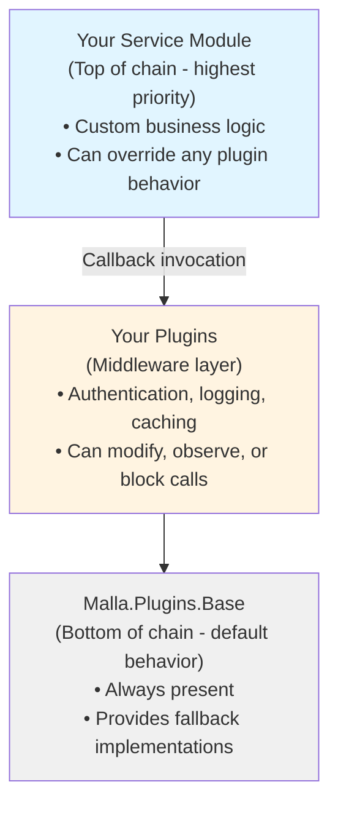

# Introduction to Malla

Malla is a framework for developing distributed services in Elixir. It simplifies distributed service development through a plugin-based architecture with compile-time callback chaining, automatic service discovery across nodes, and minimal "magic" to keep systems understandable.

## Not Just for Distributed Systems

While Malla excels at distributed computing, you don't need a cluster to benefit from it. On a single node, Malla gives you a plugin-based service architecture with compile-time callback chaining, runtime plugin management (add, remove, or reconfigure plugins without restarting), service lifecycle control, and built-in observability. If you need structured, evolvable services with runtime flexibility — even on a single BEAM instance — Malla has you covered. Distribution is there when you need it, but the service-management and runtime capabilities stand on their own.

## Why Malla?

Developing distributed services can be challenging. Malla simplifies the process by handling much of the boilerplate while giving you the flexibility to implement custom behaviors and use any libraries without enforced constraints.

Malla is built on years of production experience running critical systems. This real-world battle testing has shaped its design to prioritize what matters most: simplicity, safe evolution, and practical flexibility.

### Key Principles

- **Simplicity and Readability First**: Production experience has taught us that keeping code simple and easy to understand is critical for long-term maintainability. Malla prioritizes straightforward, readable code over clever abstractions. The plugin architecture promotes focused code where each plugin handles a single concern. Compile-time callback chains mean no runtime complexity.
- **Safe Evolution Through Plugins**: Add new functionality or modify behavior without touching existing code. Plugins compose transparently, following the [Open/Closed Principle](https://en.wikipedia.org/wiki/Open%E2%80%93closed_principle). This reduces risk in production deployments—deactivate problematic plugins on the fly without requiring a full system restart.
- **No Technology Lock-In**: Malla has little friction with other libraries and integrates with your existing codebase incrementally. All built-in and future released plugins are optional. Use Malla for only part of your system—start with a single distributed service and expand gradually.

### Core Features

- **Plugin-Based Architecture**: Compose behavior through plugins with compile-time callback chaining (zero runtime overhead). Plugins can be **added and removed at runtime**, what is a game-changer for production operations.
- **Automatic Service Discovery**: Services automatically discover each other across the cluster.
- **Distributed RPC**: Call service functions on remote nodes transparently.
- **Service Lifecycle Management**: Control service state with admin statuses (`:active`, `:pause`, `:inactive`) and monitor their running status.
- **Dynamic Runtime Control**: Modify service behavior and plugin configurations in real-time. Deactivate problematic plugins on the fly without requiring a full system restart.
- **Extensive Documentation** and **Extensive Test Coverage**: Every major feature is documented and included in a test.

### Optional Included Utilities

- **Status and Error Management**: Built-in status tracking and error handling.
- **Process Registry**: Service-level process registration.
- **Tracing and Logging**: An instrumentation interface for observability.
- **Configuration Management**: Multi-layer configuration with deep merging.
- **Storage**: ETS-based storage per service.

## Architecture Overview

### Plugin System

Malla's architecture centers on a sophisticated plugin system where behavior is composed through callback chains resolved at compile time:

Key characteristics:
- Service modules (using `Malla.Service`) are themselves plugins.
- Dependencies form a hierarchy: `Malla.Plugins.Base` (bottom) → plugins → your service module (top).
- Each callback invocation walks the chain from top to bottom until a plugin returns something different than `:cont`.
- This process has **zero runtime overhead**, as all chains are resolved at compile time.

### Distributed Services

Services marked as `global: true` automatically:
- Join the cluster-wide process group.
- Announce themselves to other nodes.
- Support automatic RPC routing with failover.
- Well-documented helper macros to make remote calls.

## Use Cases

Malla is ideal for:

- **Microservices Architecture**: Build distributed microservices that discover and communicate with each other.
- **Real-Time Systems**: Create services that require low-latency communication across nodes.
- **Scalable Applications**: Horizontally scale services with automatic load balancing.
- **Production Systems**: Deploy on Kubernetes and other modern platforms.

## Interactive Learning

The best way to learn Malla is through our interactive LiveBook tutorials. These hands-on guides let you experiment with Malla in a live environment:

- **[Getting Started Tutorial](../livebook/getting_started.livemd)** - Build a calculator service step-by-step to learn:
  - Creating services and publishing APIs
  - Extracting functionality into reusable plugins
  - Composing plugins to modify behavior
  - Runtime reconfiguration of services
  
- **[Distributed Services Tutorial](../livebook/distributed_tutorial.livemd)** - Master distributed computing across two LiveBook sessions:
  - Setting up a multi-node cluster
  - Automatic service discovery in action
  - Making transparent remote calls
  - Bidirectional service communication

Open these tutorials in [LiveBook](https://livebook.dev/) for an interactive, hands-on learning experience.

## What's Next?

- [Quick Start](02-quick-start.md) - Create your first distributed service.
- [Services](03-services.md) - Learn about service fundamentals.
- [Plugins](04-plugins.md) - Understand the plugin system.
