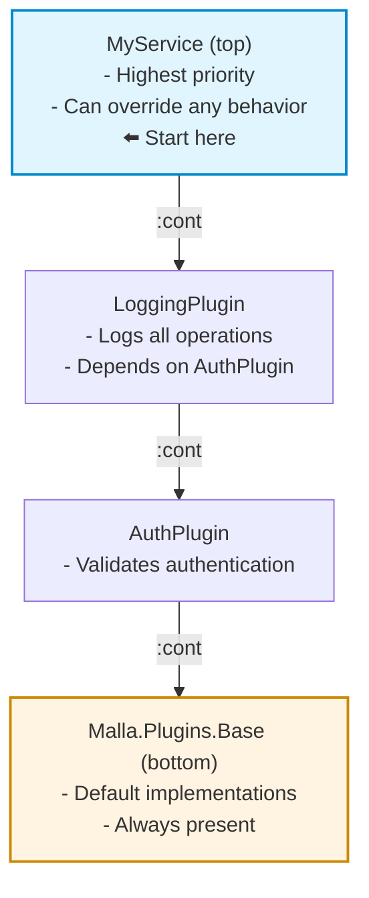

# Plugins

Plugins are the fundamental building blocks for creating reusable and composable behaviors in Malla. They allow you to extend Malla services with custom functionality by implementing callbacks that participate in compile-time callback chains.

In Malla, everything is a plugin:
- Service modules themselves are plugins (the top-level plugin in a chain).
- `Malla.Plugins.Base` is a special plugin that is always at the bottom of the hierarchy.

## Using Plugins

You add plugins to a service using the `:plugins` option in the `use Malla.Service` macro.

```elixir
defmodule MyService do
  use Malla.Service,
    plugins: [Malla.Plugins.Tracer, MyCustomPlugin]
  
  defcb my_callback(arg) do
    # Your service's implementation of the callback
    :cont
  end
end
```

## Creating a Plugin

To create a plugin, you `use Malla.Plugin` in a module. You can then implement lifecycle callbacks and `defcb` callbacks.

```elixir
defmodule MyPlugin do
  use Malla.Plugin,
    plugin_deps: [AnotherPlugin]
  
  # Lifecycle callback - configure the plugin
  @impl true
  def plugin_config(srv_id, config) do
    # Validate or modify the service configuration
    validated_config = validate_my_config(config)
    {:ok, validated_config}
  end
  
  # Lifecycle callback - start supervised children
  @impl true
  def plugin_start(srv_id, config) do
    # Return child specs for the service's supervisor
    children = [
      {MyWorker, config: config[:key1]}
    ]
    {:ok, children: children}
  end
  
  # A `defcb` callback that participates in the callback chain
  defcb process_data(data) do
    transformed = transform(data)
    # Continue the chain with the transformed data
    {:cont, transformed}
  end
end
```

## Plugin Dependencies and Hierarchy

Plugins can declare dependencies on other plugins, creating a hierarchy that determines the execution order of callbacks.

```elixir
defmodule AuthPlugin do
  use Malla.Plugin
end

defmodule LoggingPlugin do
  use Malla.Plugin,
    plugin_deps: [AuthPlugin] # Depends on AuthPlugin
end

defmodule MyService do
  use Malla.Service,
    plugins: [LoggingPlugin] # AuthPlugin is automatically included
end
```

The `plugin_deps` option establishes a dependency relationship. When a callback is invoked, it walks down the chain from the highest-level plugin (the service) to the lowest-level one (`Malla.Plugins.Base`).

For the example above, the callback chain order is:



Execution order: MyService → LoggingPlugin → AuthPlugin → Malla.Plugins.Base

### Optional Dependencies

You can mark a dependency as optional. The plugin will be included only if it can be found in the codebase.

```elixir
use Malla.Plugin,
  plugin_deps: [
    RequiredPlugin,
    {OptionalPlugin, optional: true}
  ]
```

### Plugin Groups

To enforce a specific ordering among a set of related plugins, you can assign them to a `group`. Plugins in the same group are made to depend on the previous plugin in the list, ensuring sequential ordering.

```elixir
# All these plugins belong to the :my_group
defmodule PluginA do; use Malla.Plugin, group: :my_group; end
defmodule PluginB do; use Malla.Plugin, group: :my_group; end
defmodule PluginC do; use Malla.Plugin, group: :my_group; end

defmodule MyService do
  use Malla.Service,
    plugins: [PluginA, PluginB, PluginC]
end
```
This results in the dependency chain `PluginC` → `PluginB` → `PluginA`. The callback execution order will be `MyService` → `PluginC` → `PluginB` → `PluginA`.

## The Callback Chain

Callbacks defined with `defcb` participate in the plugin chain. When a callback is invoked, execution starts at the top of the hierarchy (the service) and proceeds downwards.

Each plugin in the chain can control the flow with its return value:
- **`:cont`**: Continue to the next plugin in the chain with the same arguments.
- **`{:cont, new_args}`** or **`{:cont, arg1, arg2}`**: Continue to the next plugin with new, modified arguments.
- **Any other value**: Stop the chain and return that value immediately.

See the [Callbacks guide](05-callbacks.md) for a more detailed explanation.

## Plugins reconfiguration

Plugins can be added and removed **at runtime**. See [Reconfiguration](07a-reconfiguration.md).

## Lifecycle Callbacks

Plugins can hook into the service lifecycle by implementing standard Elixir behaviours. These are optional.

- `c:Malla.Plugin.plugin_config/2`: Called during the configuration phase (top-down). Each plugin can validate and modify the service configuration.
- `c:Malla.Plugin.plugin_config_merge/3`: Called when new configuration options need to be merged (during startup with runtime config, or during reconfiguration).
- `c:Malla.Plugin.plugin_start/2`: Called during the start phase (bottom-up). Each plugin can initialize resources and return a list of child processes to be supervised.
- `c:Malla.Plugin.plugin_updated/3`: Called when a service's configuration is updated at runtime. Can request a restart if needed.
- `c:Malla.Plugin.plugin_stop/2`: Called during the stop phase (top-down). Each plugin can clean up its resources before its children are stopped.

See the [Lifecycle guide](06-lifecycle.md) for more details on the complete lifecycle, and the [Reconfiguration guide](07a-reconfiguration.md) for details on runtime configuration updates.
