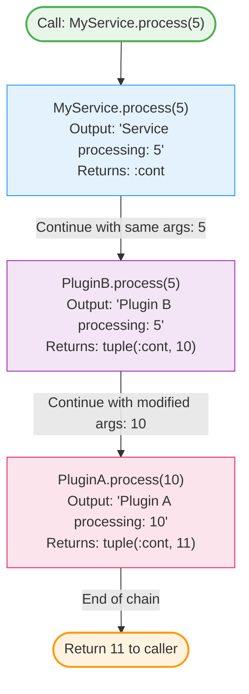

# Callbacks

Callbacks are special functions that participate in Malla's compile-time callback chain, allowing for extensible and composable service behavior. They are the core mechanism through which plugins interact and modify functionality.

## Defining Callbacks

You define a callback using the `defcb` macro instead of the standard `def`.

```elixir
defmodule MyService do
  use Malla.Service
  
  # This is a regular function and does not participate in the callback chain.
  def regular_function(arg) do
    arg * 2
  end
  
  # This is a callback and is part of the plugin chain.
  defcb my_callback(arg) do
    # Process the argument
    result = process(arg)
    
    # Continue the chain, passing the modified result to the next plugin.
    {:cont, result}
  end
  
  # This callback might stop the chain based on a condition.
  defcb another_callback(arg) do
    if should_stop?(arg) do
      # Stops the chain and returns this value to the original caller.
      {:ok, :stopped}
    else
      # Continues the chain with the same arguments.
      :cont
    end
  end
end
```

At compile time, the `defcb` macro renames your implementation (e.g., to `my_callback_malla_service`) and generates a final dispatching version of the function that handles walking the plugin chain. This means there is **zero runtime overhead** for the callback dispatch mechanism.

## Accessing the Service ID

Before Malla invokes a callback on a service, it stores the service's ID in the process dictionary. This allows you to easily access the current service ID from within your callback implementation using `Malla.get_service_id/0`.

Many functions in the Malla API are context-aware. If you omit the `service_id` argument when calling them from within a callback, they will automatically use the ID from the process dictionary.

```elixir
defmodule MyService do
  use Malla.Service

  defcb my_callback(arg) do
    # Retrieve the current service ID
    service_id = Malla.get_service_id()

    # Call a Malla function without explicitly passing the service_id.
    # It will automatically use the service_id from the process dictionary.
    Malla.some_function(arg)

    :cont
  end
end
```

This feature simplifies your code by reducing the need to pass the `service_id` around manually.

## Controlling the Chain with Return Values

The value returned by a `defcb` callback determines how the chain proceeds.

#### `:cont` - Continue with Same Arguments
Return `:cont` to signal that the next plugin in the chain should be called with the exact same arguments.

```elixir
defcb process(data) do
  # Perform a side-effect, like logging.
  Logger.info("Processing data: #{inspect(data)}")
  
  # Continue the chain.
  :cont
end
```

#### `{:cont, new_args}` - Continue with Modified Arguments
Return a tuple starting with `:cont` to continue the chain but with a new set of arguments. The arguments can be in a list or as separate elements in the tuple.

```elixir
# Using a list of arguments
defcb transform(data) do
  transformed = transform_data(data)
  {:cont, [transformed]}
end

# Using multiple elements in the tuple
defcb split(data1, data2) do
  part1b = transform_data(data1)
  {:cont, [part1b, part2]}
end
```

#### Any Other Value - Stop the Chain
Return any value that is not `:cont` or a `{:cont, ...}` tuple to stop the execution of the callback chain immediately. This value will be returned to the original caller.

```elixir
defcb validate(data) do
  if valid?(data) do
    # Data is valid, let the chain continue.
    :cont
  else
    # Data is invalid, stop the chain and return an error.
    {:error, :invalid_data}
  end
end
```

## A Note on Catch-All Clauses
When implementing a callback, it is good practice to include a "catch-all" clause that returns `:cont`. This ensures that your callback gracefully handles arities or argument patterns it doesn't explicitly support, allowing other plugins in the chain to continue processing.

For example:

```elixir
defmodule MyRobustPlugin do
  use Malla.Plugin

  # Specifically handle a 2-tuple
  defcb my_callback({key, value}) do
    # process the tuple
    {:cont, {key, process_value(value)}}
  end

  # Catch-all for any other arguments
  defcb my_callback(_args) do
    :cont
  end
end
```

Without the catch-all clause, a call to `my_callback` with an unexpected argument (e.g., `my_callback("some string")`) would raise a `FunctionClauseError`, halting the entire callback chain. The catch-all prevents this by simply allowing the chain to continue unmodified.

## How Callback Chains Work

### Execution Flow Diagram



### Example Code

Given the following setup:

```elixir
defmodule PluginA do
  use Malla.Plugin
  
  defcb process(x) do
    IO.puts("Plugin A processing: #{x}")
    {:cont, x + 1}
  end
end

defmodule PluginB do
  use Malla.Plugin,
    plugin_deps: [PluginA] # Depends on PluginA
  
  defcb process(x) do
    IO.puts("Plugin B processing: #{x}")
    {:cont, x * 2}
  end
end

defmodule MyService do
  use Malla.Service,
    plugins: [PluginB] # Depends on PluginB
  
  defcb process(x) do
    IO.puts("Service processing: #{x}")
    :cont
  end
end
```

The dependency hierarchy is `MyService` → `PluginB` → `PluginA`. When you call `MyService.process(5)`, the execution flows from top to bottom:

1.  `MyService.process(5)` is called. It prints "Service processing: 5" and returns `:cont`.
2.  The chain continues to `PluginB.process(5)`. It prints "Plugin B processing: 5" and returns `{:cont, 10}`. The argument for the next plugin is now `10`.
3.  The chain continues to `PluginA.process(10)`. It prints "Plugin A processing: 10" and returns `{:cont, 11}`.
4.  The chain has reached the end. The final value `11` is returned to the original caller.

## Next Steps

- [Plugins](04-plugins.md) - Understand how plugins use callbacks to create composable behavior.
- [Services](03-services.md) - See how to use callbacks within the context of a Malla service.
