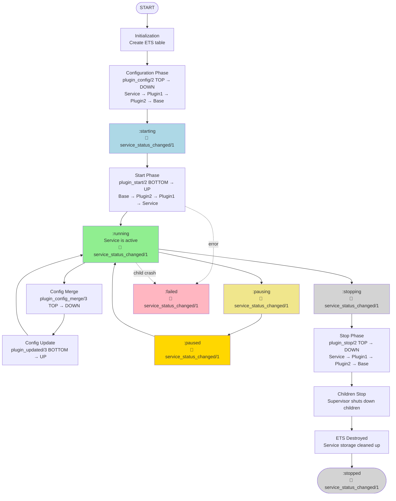

# Service Lifecycle

This guide covers the complete lifecycle of a Malla service, from startup and configuration to shutdown and error handling.

## Lifecycle States

A Malla service has two independent status dimensions: an **Admin Status** that is controlled by the user/operator, and a **Running Status** that reflects the current operational state of the service.

### Admin Status
This status is set manually to control the desired state of the service.
- `:active` - The service should be running and processing requests.
- `:pause` - The service should be temporarily paused. It stops processing new requests, but its supervised children remain running.
- `:inactive` - The service should not be running. Its children are stopped, and it will not process requests.

You can change the admin status using `Malla.Service.set_admin_status/2`.

### Running Status
This status represents the actual state of the service process.
- `:starting` - The service is performing its startup sequence.
- `:running` - The service is fully active and processing requests.
- `:pausing` - The service is transitioning to the `:paused` state.
- `:paused` - The service is paused and not processing new work.
- `:stopping` - The service is performing its shutdown sequence.
- `:stopped` - The service has stopped cleanly.
- `:failed` - The service has encountered an error and terminated. It may be restarted by its supervisor.

You can monitor the running status using `Malla.Service.get_status/1`.

## Lifecycle Sequence

### Visual Overview



### 1. Startup Sequence
When [`MyService.start_link/1`](`c:Malla.Service.Interface.start_link/1`) is called (either directly or by a supervisor):

1.  **Initialization**: An ETS table for service-specific storage is created.
2.  **Configuration Phase** (Top-down): The `c:Malla.Plugin.plugin_config/2` callback is invoked for each plugin, starting from the service module and moving down the dependency chain. Each plugin can validate and modify the configuration for the plugins that depend on it.
4.  **Start Phase** (Bottom-up): The `c:Malla.Plugin.plugin_start/2` callback is invoked for each plugin, starting from the lowest-level dependency (`Malla.Plugins.Base`) and moving up to the service module. Each plugin can return a list of child specs to be started under the service's dedicated supervisor.
5.  **Running**: Once all plugins have started successfully, the service's running status is set to `:running`.

### 2. Reconfiguration
You can update a service's configuration at runtime by calling [`Malla.Service.reconfigure(MyService, new_config)`](`Malla.Service.reconfigure/2`). This process involves two callbacks:

1. **Configuration Merge Phase** (Top-down): The `c:Malla.Plugin.plugin_config_merge/3` callback is invoked for each plugin, starting from the service module and moving down the dependency chain. Each plugin can implement custom merge logic for its configuration keys. If not implemented, configurations are deep-merged automatically.

2. **Update Phase** (Bottom-up): The `c:Malla.Plugin.plugin_updated/3` callback is invoked for each plugin, starting from the lowest-level dependency and moving up. Each plugin receives the old and new configuration and can optionally request a restart if the configuration change requires it.

For a comprehensive guide to reconfiguration, including adding/removing plugins dynamically and handling dynamic vs. restart-required changes, see the [Reconfiguration guide](07a-reconfiguration.md).

### 3. Pause and Resume
- [`Malla.Service.set_admin_status(MyService, :pause)`](`Malla.Service.set_admin_status/2`): The service's running status becomes `:paused`. It will stop accepting new work, but its supervised children continue to run.
- [`Malla.Service.set_admin_status(MyService, :active)`](`Malla.Service.set_admin_status/2`): The service resumes normal operation.

### 4. Shutdown Sequence
When a service is stopped (either via [`MyService.stop/0`](`c:Malla.Service.Interface.stop/0`) or by its supervisor):

1.  **Stop Phase** (Top-down): The `c:Malla.Plugin.plugin_stop/2` callback is invoked for each plugin, from the service down to its dependencies. This allows plugins to perform cleanup, release resources, and close connections gracefully.
2.  **Children Stopped**: The service's supervisor shuts down all the children that were started by the plugins.
3.  **ETS Table Destroyed**: The service's dedicated ETS storage table is destroyed, and all data within it is lost.
4.  **Final State**: The running status becomes `:stopped` and the process terminates.

## Status Change Notifications

Every time the service's running status changes (`:starting`, `:running`, `:paused`, `:stopped`, `:failed`), the `c:Malla.Plugins.Base.service_status_changed/1` callback is invoked on all plugins in the callback chain. This allows plugins to react to status changes, such as:

- Opening or closing connections when transitioning to/from `:running`
- Logging status changes for monitoring
- Triggering health check updates
- Coordinating with external systems

Example implementation in a plugin:

```elixir
defmodule MyPlugin do
  use Malla.Plugin
  
  defcb service_status_changed(status) do
    case status do
      :running ->
        Logger.info("Service is now running")
        # Open connections, start accepting work
      :paused ->
        Logger.info("Service is paused")
        # Stop accepting new work
      :stopped ->
        Logger.info("Service stopped")
      _ ->
        :ok
    end
    
    # Always return :cont to allow other plugins to handle the status change
    :cont
  end
end
```

**Important**: Always return `:cont` from `c:Malla.Plugins.Base.service_status_changed/1` so that the callback chain continues and all plugins receive the notification.

## Readiness and Health Checks

Malla provides a readiness mechanism to determine if a service is fully operational and ready to accept work. This is particularly useful for:
- Kubernetes readiness probes
- Load balancer health checks
- Service mesh integration
- Coordinated service deployment

### Readiness Check

Call `Malla.Service.is_ready?/1` to check if the service is ready. This function:
1. Returns `false` if the running status is not `:running`.
2. If status is `:running`, invokes the `c:Malla.Plugins.Base.service_is_ready?/0` callback chain across all plugins.
3. Returns `true` only if all plugins return `:cont` (meaning they are ready).
4. Returns `false` if any plugin returns `false` (meaning it's not ready).

Example implementation in a plugin:

```elixir
defmodule DatabasePlugin do
  use Malla.Plugin
  
  defcb service_is_ready?() do
    # Check if database connection pool is established
    case Malla.Service.get(__MODULE__, :db_pool_ready) do
      true -> :cont  # This plugin is ready, check next plugin
      false -> false  # Not ready, stop the chain and return false
    end
  end
end
```

**Important**: Plugins should return `:cont` when ready to allow the chain to continue, or `false` to indicate they are not ready. Never return `true` directly from `service_is_ready?/0`.

## Graceful Shutdown and Drain

Malla provides a drain mechanism for graceful shutdowns, allowing services to complete in-flight work before terminating. This is essential for:
- Zero-downtime deployments
- Kubernetes pod termination
- Coordinated cluster updates
- Preventing data loss during shutdown

### Drain Process

Call `Malla.Service.drain/1` to initiate a graceful shutdown. This function:
1. Invokes the `c:Malla.Plugins.Base.service_drain/0` callback chain across all plugins.
2. Each plugin should clean up its state and stop accepting new work.
3. Returns `true` if all plugins return `:cont` (all plugins are fully drained).
4. Returns `false` if any plugin returns `false` (drain not complete, needs retry).

The drain mechanism is typically used in two phases:

1. **Mark service as draining**: Stop accepting new work, but continue processing existing requests
2. **Poll until drained**: Repeatedly call `drain/1` until it returns `true`, then stop the service

Example implementation in a plugin:

```elixir
defmodule WebServerPlugin do
  use Malla.Plugin
  
  defcb service_drain() do
    srv_id = Malla.get_service_id!()
    
    # Check if we have any active connections
    active_connections = Malla.Service.get(srv_id, :active_connections, 0)
    
    case active_connections do
      0 ->
        # No active connections, we're fully drained
        Logger.info("WebServer fully drained")
        :cont
      
      count ->
        # Still have active connections, not ready to stop
        Logger.info("WebServer draining: #{count} active connections remaining")
        false
    end
  end
end
```

### Typical Drain Workflow

Here's a typical graceful shutdown workflow using the drain mechanism:

```elixir
# 1. Mark service as paused (stops accepting new work)
Malla.Service.set_admin_status(MyService, :pause)

# 2. Poll until all in-flight work completes
defp wait_for_drain(service, retries \\ 30) do
  case Malla.Service.drain(service) do
    true ->
      Logger.info("Service fully drained")
      :ok
    
    false when retries > 0 ->
      Logger.info("Waiting for drain, #{retries} retries left")
      Process.sleep(1000)
      wait_for_drain(service, retries - 1)
    
    false ->
      Logger.warning("Drain timeout, forcing shutdown")
      {:error, :drain_timeout}
  end
end

wait_for_drain(MyService)

# 3. Stop the service
Malla.Service.stop(MyService)
```

**Important**: Plugins should return `:cont` when fully drained to allow the chain to continue, or `false` if they still have work to complete. The drain can be called multiple times until all plugins report completion.

## Error Handling

If a service's supervised child crashes and the supervisor's restart strategy is exhausted, the service itself will crash.
1.  **Status Update**: The running status becomes `:failed`, triggering `c:Malla.Plugin.Base.service_status_changed/1` callbacks.
2.  **Supervisor Restart**: The service's own supervisor will then attempt to restart it according to its configured strategy. This will trigger the full startup sequence again.

## Lifecycle Callbacks Summary

Plugins can implement these callbacks to hook into the service lifecycle.

### Standard Plugin Lifecycle Callbacks

These are standard Elixir behaviours defined in `Malla.Plugin`:

| Callback | Order | Trigger | Purpose |
| :--- | :--- | :--- | :--- |
| `c:Malla.Plugin.plugin_config/2` | Top → Bottom | Startup, Reconfiguration | Validate and modify configuration. |
| `c:Malla.Plugin.plugin_config_merge/3` | Top → Bottom | Startup (with runtime config), Reconfiguration | Custom merge logic for configuration updates. |
| `c:Malla.Plugin.plugin_start/2` | Bottom → Top | Startup | Return child specs to be supervised. |
| `c:Malla.Plugin.plugin_updated/3` | Bottom → Top | Reconfiguration | Handle dynamic configuration changes, optionally request restart. |
| `c:Malla.Plugin.plugin_stop/2` | Top → Bottom | Shutdown | Clean up resources before termination. |

### Malla Callbacks (defcb)

These callbacks are defined with `defcb` and participate in the callback chain:

| Callback | Chain Order | Trigger | Purpose |
| :--- | :--- | :--- | :--- |
| `c:Malla.Plugins.Base.service_status_changed/1` | Top → Bottom | Status changes | React to running status changes (`:starting`, `:running`, `:paused`, `:stopped`, `:failed`). Always return `:cont`. |
| `c:Malla.Plugins.Base.service_is_ready?/0` | Top → Bottom | `Malla.Service.is_ready?/1` | Check if service is ready to accept work. Return `:cont` if ready, `false` if not. Used for health checks. |
| `c:Malla.Plugins.Base.service_drain/0` | Top → Bottom | `Malla.Service.drain/1` | Prepare for graceful shutdown. Return `:cont` when fully drained, `false` if still has work. Can be retried. |

## Next Steps

- [Services](03-services.md) - Review the fundamentals of Malla services.
- [Plugins](04-plugins.md) - Understand how plugins define and use these lifecycle hooks.
- [Configuration](07-configuration.md) - Learn more about how configuration is handled during the lifecycle.
- [Reconfiguration](07a-reconfiguration.md) - Deep dive into runtime configuration updates and dynamic plugin management.
